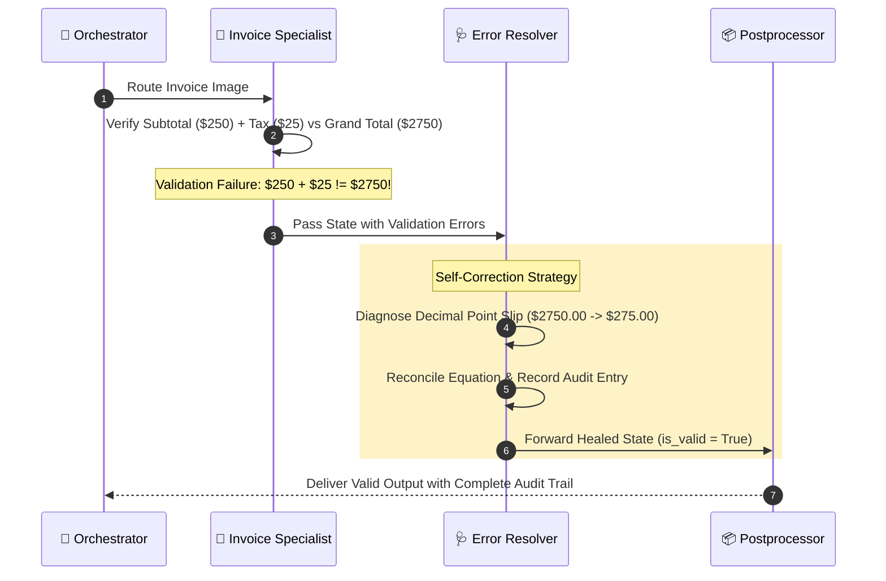

# 🔍 LangGraph Multi-Agent OCR & Self-Healing Platform

[](https://www.python.org/downloads/)
[](https://github.com/langchain-ai/langgraph)
[-green.svg)](https://github.com/RapidAI/RapidOCR)
[](https://streamlit.io/)
[-brightgreen.svg)]()
[]()

An enterprise-grade, agentic Optical Character Recognition (OCR) platform built with **LangGraph**. Designed for high-accuracy text extraction across diverse document topologies, featuring intelligent domain routing and **autonomous self-healing loops** that detect errors, resolve character confusion and math discrepancies, and continue workflow execution without termination.

---

## 📑 Table of Contents
- [Key Business Domains](#-key-business-domains)
- [System Architecture & Flowchart](#-system-architecture--flowchart)
- [Multi-Agent Roster](#-multi-agent-roster)
- [Autonomous Self-Healing Loop](#-autonomous-self-healing-loop)
- [Project Directory Structure](#-project-directory-structure)
- [Quick Start Guide](#-quick-start-guide)
  - [Interactive Web UI](#1-launch-the-interactive-web-dashboard)
  - [CLI Demo](#2-run-the-terminal-cli-demo)
  - [Automated Testing](#3-run-automated-test-suite)
- [Testing & Verification Matrix](#-testing--verification-matrix)
- [Executive Presentation (PPT)](#-executive-presentation-ppt)

---

## 🎯 Key Business Domains

The platform natively supports three high-impact commercial use cases:

1. **📄 Paper Document Digitizer (Archiving & Semantic Search)**
   - Extracts structural hierarchies (title, headers, subheaders, body paragraphs).
   - Reconstructs reading order across columns.
   - Generates inverted full-text search indexes with keyword token frequencies.
   - Exports clean Markdown and archival JSON.

2. **🚗 Smart Traffic License Plate Recognition (ANPR / ALPR)**
   - High-speed alphanumeric plate extraction.
   - Validates jurisdiction syntax against US, UK, and EU traffic standards.
   - Filters out decorative license frames, dealer logos, and bolt artifacts.
   - Generates smart traffic telemetry: Toll gate ID, lane allocation, speed estimation, and compliance checks.

3. **🧾 Invoice & Receipt Scanner (Automated Accounting Data Entry)**
   - Parses vendor names, invoice IDs, billing dates, and itemized line item tables.
   - **Mathematical Integrity Audit**: Rigorously validates:
     $$\sum \text{Line Items} = \text{Subtotal}$$
     $$\text{Subtotal} + \text{Tax} = \text{Grand Total}$$
   - Reconciles decimal point shifts and missing tax fields.

---

## 🔄 System Architecture & Flowchart

```mermaid
flowchart TD
    User([Input Image / Document]) --> Preprocessor["🛠️ Preprocessor Agent\n(Deskew, CLAHE, Noise Cleanup, Inversion)"]
    
    subgraph Core_Pipeline ["Agentic Extraction Pipeline"]
        Preprocessor --> OCR["👁️ Unified OCR Engine\n(RapidOCR ONNX + Tesseract Fallback)"]
        OCR --> Orchestrator["🧠 Orchestrator Agent\n(Intent & Domain Classification)"]
        
        Orchestrator -->|Document Cues| DocAgent["📄 Document Digitizer Agent\n(Layout, Paragraphs, Search Index)"]
        Orchestrator -->|Vehicle Plate Cues| PlateAgent["🚗 License Plate (ANPR) Agent\n(ANPR & Smart Traffic Telemetry)"]
        Orchestrator -->|Financial Cues| InvAgent["🧾 Invoice Scanner Agent\n(Accounting & Math Audit)"]
        
        DocAgent --> CheckValidation{"Validation Check\n(Confidence, Math, Syntax)"}
        PlateAgent --> CheckValidation
        InvAgent --> CheckValidation
    end

    subgraph Self_Healing_Loop ["Autonomous Self-Correction Subsystem"]
        CheckValidation -->|Discrepancy / Low Conf| ErrorResolver["🩺 Error Resolver Agent\n(Self-Correction & Diagnosis)"]
        
        ErrorResolver -->|Re-filter Image (Loop)| Preprocessor
        ErrorResolver -->|In-Memory Reconciled| Postprocessor["📦 Postprocessor Agent\n(Packaging, Markdown, Search Index)"]
    end

    CheckValidation -->|All Valid| Postprocessor
    Postprocessor --> Output([Structured JSON & Telemetry Delivered])
    
    style Self_Healing_Loop fill:#fef3c7,stroke:#d97706,stroke-width:2px;
    style Core_Pipeline fill:#f0f9ff,stroke:#0284c7,stroke-width:2px;
```

---

## 🤖 Multi-Agent Roster

| Agent | Responsibility | Core Logic & Algorithms |
| :--- | :--- | :--- |
| **🧠 Orchestrator Agent** | Document classification & dynamic routing | Multi-cue heuristic evaluator: aspect ratio analysis, keyword frequency scoring, and token count weighting. |
| **🛠️ Preprocessor Agent** | Image enhancement & deskewing | Laplacian blur estimation, HoughLinesP deskew angle detector, CLAHE contrast boost, bilateral filtering, and dark-background inversion. |
| **👁️ RapidOCR Engine** | Text detection & recognition | CPU/GPU ONNX Runtime execution with bounding box coordinates and token confidence scores. |
| **📄 Document Digitizer** | Archival & layout extraction | Reading-order sequencing, section segmentation, token frequency counting, and inverted search index generation. |
| **🚗 License Plate Agent** | Smart traffic ANPR | Candidate scoring, regex jurisdiction matching (US/UK/EU), character length constraints, and telemetry simulation. |
| **🧾 Invoice Scanner Agent** | Financial accounting entry | Entity parsing (vendor, date, line items, totals) and mathematical audit verification. |
| **🩺 Error Resolver Agent** | **Autonomous self-healing loop** | Intercepts validation failures, repairs decimal shifts and character confusions (`'O'` $\leftrightarrow$ `'0'`), or re-triggers image filtering loops. |
| **📦 Postprocessor Agent** | Final output packaging | Bundles structured JSON, generates Markdown, and compiles audit records. |

---

## 🩺 Autonomous Self-Healing Loop

Traditional OCR workflows fail or crash when an image contains glare, character confusion, or a missing decimal point. This platform incorporates a **cyclical LangGraph feedback loop**:



### Self-Correction Strategies:
1. **Mathematical Rebalancing**: Detects misplaced decimals (e.g. `$2750.00` instead of `$275.00`), recalculates grand totals, and infers missing taxes.
2. **Optical Confusion Disambiguation**: Enforces format syntax rules to resolve ambiguous characters (e.g. `'O'` vs `'0'`, `'I'` vs `'1'`, `'B'` vs `'8'`).
3. **Adaptive Image Re-filtering**: If an image is too dark or degraded, requests `invert_colors` or `aggressive_clahe`, loops back to the Preprocessor, and re-scans.
4. **Infinite Loop Safeguard**: Tracks `retry_count` against `max_retries` (default: 2) to ensure termination with graceful degradation on unreadable images.

---

## 📁 Project Directory Structure

```text
ocr_multiagent_system/
├── ocr_agentic_system/
│   ├── core/
│   │   ├── __init__.py
│   │   └── state.py                    # LangGraph TypedDict state contract
│   ├── engine/
│   │   ├── __init__.py
│   │   └── ocr_engine.py               # RapidOCR (ONNX) + PyTesseract fallback
│   ├── agents/
│   │   ├── __init__.py
│   │   ├── preprocessor_agent.py       # Computer vision filters & deskewing
│   │   ├── orchestrator_agent.py       # Domain classifier & dynamic router
│   │   ├── document_digitizer_agent.py # Archival document specialist & search indexer
│   │   ├── license_plate_agent.py      # ANPR smart traffic specialist
│   │   ├── invoice_scanner_agent.py    # Accounting & math integrity auditor
│   │   └── error_resolver_agent.py     # Self-healing loop & error recovery
│   ├── graph/
│   │   ├── __init__.py
│   │   └── workflow.py                 # LangGraph StateGraph & conditional routing
│   ├── utils/
│   │   ├── __init__.py
│   │   └── synthetic_generator.py      # Generates synthetic test images for all domains
│   ├── app.py                          # Interactive Streamlit Web Dashboard
│   └── cli.py                          # Rich terminal CLI interface
├── sample_data/                        # Pre-generated sample images (Clean & Erroneous)
├── tests/
│   └── test_ocr_multiagent.py          # Pytest unit & integration test suite
├── IMPLEMENTATION_PLAN.md              # Detailed implementation plan
├── SYSTEM_ARCHITECTURE_FLOWCHART.md    # Mermaid architectural blueprints
├── TASKS_LIST.md                       # Task list & milestone verification
├── OCR_MultiAgent_LangGraph_Platform.pptx # Executive PowerPoint presentation
├── generate_presentation.py            # Python PPTX generation script
├── requirements.txt                    # Python dependency manifest
├── run_ocr_app.py                      # Top-level launcher script
└── README.md
```

---

## 🚀 Quick Start Guide

### Prerequisites
- Python 3.10 or 3.11 installed.

### Setup
```bash
# Clone the repository
git clone https://github.com/pankajatd/ocr-multiagent-langgraph-platform.git
cd ocr-multiagent-langgraph-platform

# Create and activate virtual environment
python -m venv venv_ocr
# On Windows:
.\venv_ocr\Scripts\Activate.ps1
# On Linux/macOS:
source venv_ocr/bin/activate

# Install dependencies
pip install -r requirements.txt
```

---

### 1. Launch the Interactive Web Dashboard

```bash
python run_ocr_app.py ui
```
*Opens `http://localhost:8501` featuring:*
- Preloaded scenario selector (clean documents, noisy scans, license plates, invoices with errors).
- Side-by-side original vs preprocessed enhanced view.
- Real-time multi-agent execution timeline.
- Live Error Self-Healing audit card.
- One-click export to structured JSON and Markdown.

---

### 2. Run the Terminal CLI Demo

Run the automated test runner across all 6 test scenarios:
```bash
python -m ocr_agentic_system.cli --demo
```

Run on a specific image (e.g. demonstrating error self-healing):
```bash
python -m ocr_agentic_system.cli --image sample_data/invoice_with_math_error.png
```

---

### 3. Run Automated Test Suite

```bash
python -m pytest -v --basetemp=./tests_tmp tests/test_ocr_multiagent.py
```

---

## 🧪 Testing & Verification Matrix

The test suite validates agent routing, entity parsing, and self-healing:

```text
============================= test session starts =============================
tests/test_ocr_multiagent.py::test_orchestrator_classification PASSED          [ 16%]
tests/test_ocr_multiagent.py::test_error_resolver_invoice_math_healing PASSED  [ 33%]
tests/test_ocr_multiagent.py::test_error_resolver_plate_confusion_healing PASSED [ 50%]
tests/test_ocr_multiagent.py::test_end_to_end_document_graph PASSED            [ 66%]
tests/test_ocr_multiagent.py::test_end_to_end_invoice_graph_with_error_resolution PASSED [ 83%]
tests/test_ocr_multiagent.py::test_end_to_end_license_plate PASSED             [100%]

============================== 6 passed in 9.61s ==============================
```

---

## 📊 Executive Presentation (PPT)

A comprehensive 7-slide 16:9 widescreen PowerPoint deck is included at:
[`OCR_MultiAgent_LangGraph_Platform.pptx`](./OCR_MultiAgent_LangGraph_Platform.pptx)

To regenerate the presentation at any time:
```bash
python generate_presentation.py
```

---

## 📄 License
MIT License. Open source and free for commercial and academic use.
