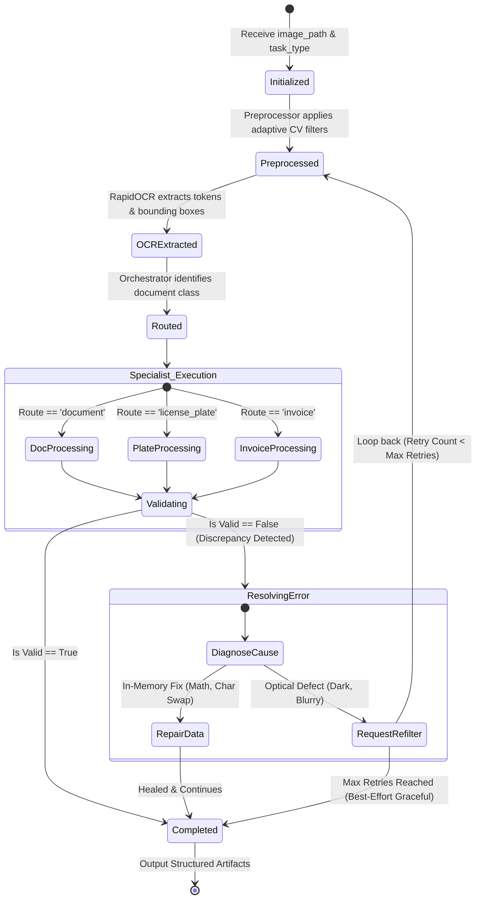
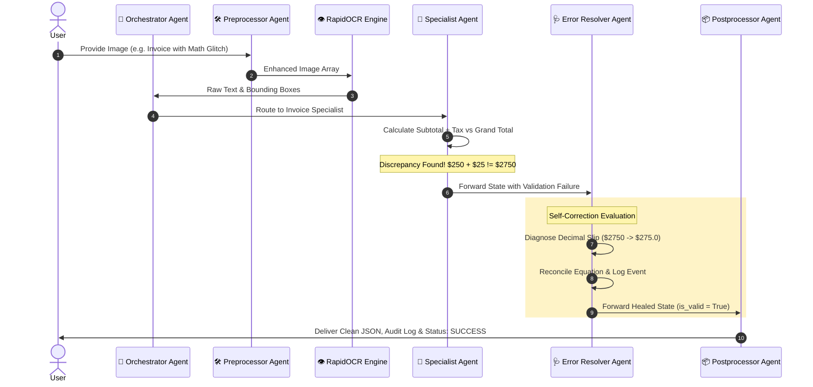
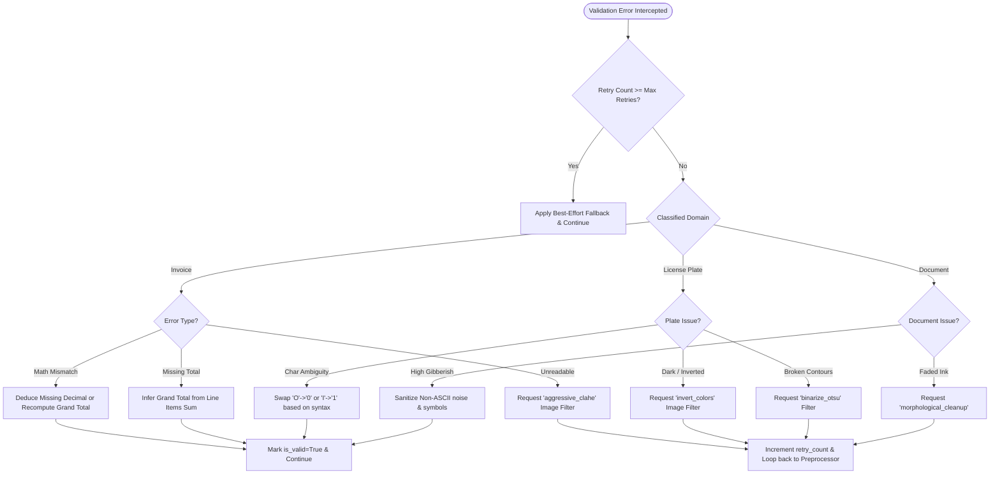

# 🔄 System Architecture & Flowchart: LangGraph Multi-Agent OCR

This document details the architectural blueprints, cyclical state transitions, agent sequence interactions, and the self-healing error resolution logic.

---

## 1. High-Level Multi-Agent Architecture

```mermaid
flowchart TD
    User([User Image Upload / Camera Stream]) --> Preprocessor["🛠️ Preprocessor Agent\n(Deskew, CLAHE, Noise Cleanup, Inversion)"]
    
    subgraph Core_Pipeline ["Agentic Processing Engine"]
        Preprocessor --> OCR["👁️ Unified OCR Engine\n(RapidOCR ONNX + Tesseract Fallback)"]
        OCR --> Orchestrator["🧠 Orchestrator Agent\n(Intent & Domain Classification)"]
        
        Orchestrator -->|Document Cues| DocAgent["📄 Document Digitizer Agent\n(Layout, Paragraphs, Search Index)"]
        Orchestrator -->|Vehicle Plate Cues| PlateAgent["🚗 License Plate Agent\n(ANPR & Smart Traffic Telemetry)"]
        Orchestrator -->|Financial Cues| InvAgent["🧾 Invoice Scanner Agent\n(Accounting & Math Audit)"]
        
        DocAgent --> CheckValidation{"Validation Check\n(Confidence, Math, Syntax)"}
        PlateAgent --> CheckValidation
        InvAgent --> CheckValidation
    end

    subgraph Self_Healing_Loop ["Autonomous Self-Correction Subsystem"]
        CheckValidation -->|Discrepancy / Low Conf| ErrorResolver["🩺 Error Resolver Agent\n(Diagnosis & Strategy Selector)"]
        
        ErrorResolver -->|Need Optical Enhancement\n(e.g., Aggressive CLAHE, Invert)| Preprocessor
        ErrorResolver -->|In-Memory Reconciled\n(Math Fix, Char Confusion)| Postprocessor["📦 Postprocessor Agent\n(Packaging, Markdown, Search Index)"]
    end

    CheckValidation -->|All Valid| Postprocessor
    Postprocessor --> Output([Structured JSON & Telemetry Delivered])
    
    style Self_Healing_Loop fill:#fef3c7,stroke:#d97706,stroke-width:2px;
    style Core_Pipeline fill:#f0f9ff,stroke:#0284c7,stroke-width:2px;
```

---

## 2. Cyclical LangGraph State Machine

The following state diagram illustrates how state transitions between nodes and how the graph resolves errors cyclically:



---

## 3. Sequence Diagram of Agent Collaboration



---

## 4. Error Resolver Decision Logic Tree


